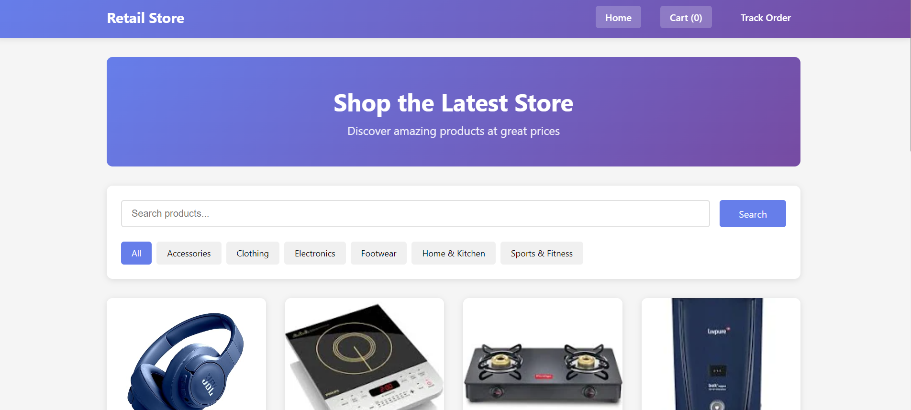
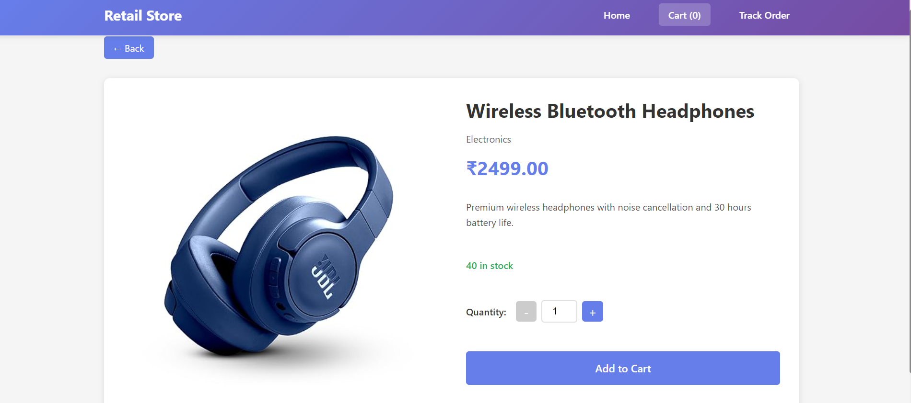
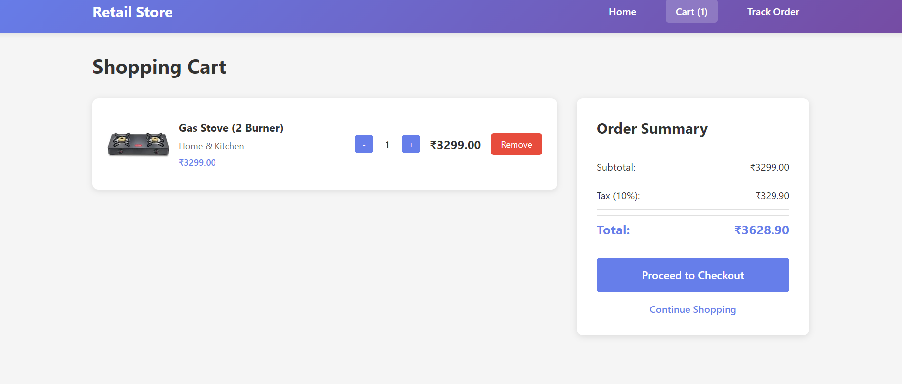
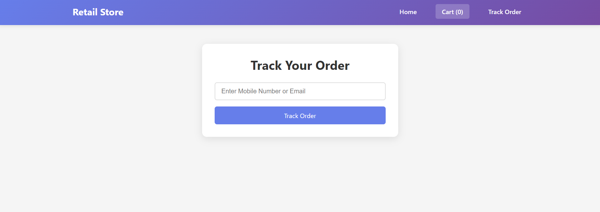
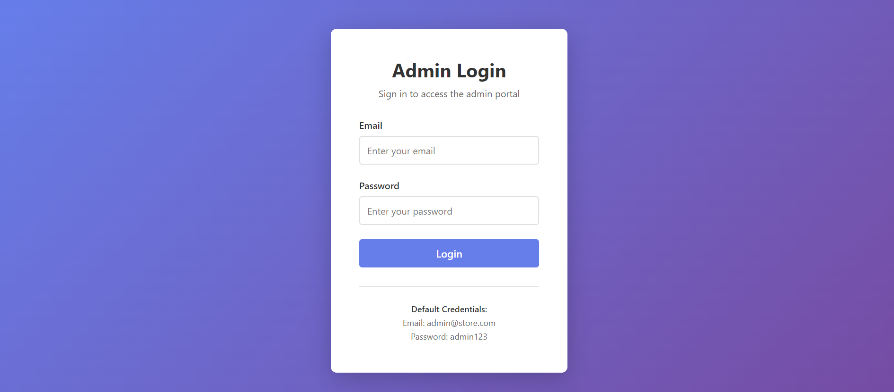
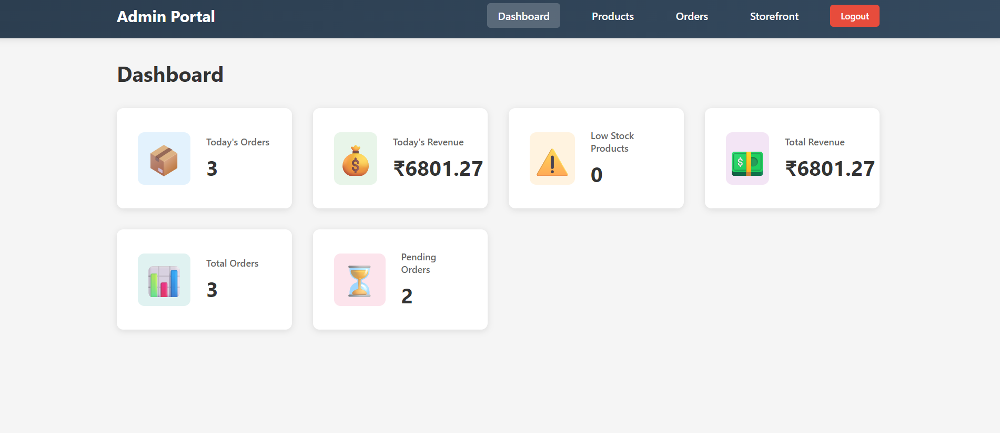
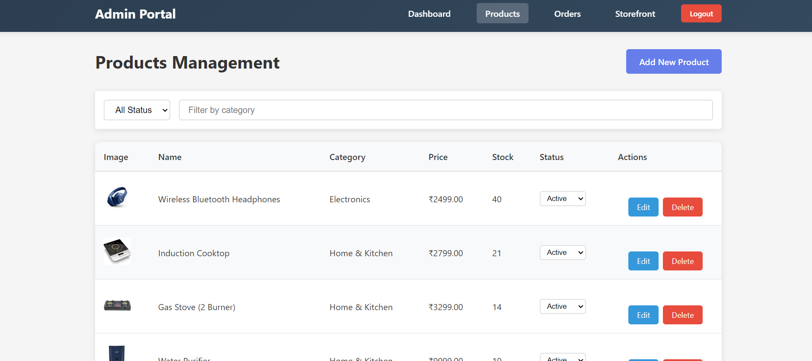

# Full-Stack Retail Storefront & Admin Portal

A complete **Full-Stack Retail Web Application** built using **React (Frontend)**, **Node.js + Express (Backend)**, and **MongoDB (Database)**.
This project includes:

- **Customer Storefront** for browsing products, cart, and placing orders
- **Admin Portal** for managing products and orders securely

---

## Features

### Customer Storefront

- View active products only
- Product search & category filter
- Product details with stock control
- Add to cart / update quantity / remove from cart
- Cart summary with **Subtotal, Tax (10%), and Total**
- Checkout with customer details
- Order placed successfully with Order ID
- Cart stored in **localStorage**

### Admin Portal (Protected)

- Secure Admin Login with JWT Authentication
- Product Management:

  - Create / Edit / Delete Products
  - Upload product image (JPG/PNG ≤ 2MB)
  - Activate / Deactivate Product

- Order Management:

  - View all orders
  - Filter by status & date
  - View order details
  - Update order status (New → Processing → Shipped → Cancelled)

- Dashboard:

  - Today’s orders
  - Total revenue
  - Low stock products

---

## Tech Stack

| Layer          | Technology              |
| -------------- | ----------------------- |
| Frontend       | React, React Router DOM |
| Backend        | Node.js, Express        |
| Database       | MongoDB + Mongoose      |
| Authentication | JWT                     |
| File Upload    | Multer                  |
| Styling        | CSS                     |
| API Client     | Axios                   |

---

## Project Structure

```
root/
 ├── backend/
 │   ├── config/db.js
 │   ├── models/
 │   ├── routes/
 │   ├── middleware/
 │   ├── uploads/
 │   ├── scripts/seed.js
 │   └── index.js
 |   └── .env
 │
 ├── frontend/
 │   ├── src/
 │   │   ├── components/
 │   │   │   ├── customer/
 │   │   │   ├── admin/
 |   |   |   ├── shared/
 │   │   ├── context/
 │   │   ├── services/
 |   |   ├── utils/
 │   │   └── App.js
```

---

## Environment Setup

### Backend `.env`

Create a `.env` file inside `backend/`

```env
PORT=5000
MONGO_URI=your_mongodb_connection_string
JWT_SECRET=your_jwt_secret
NODE_ENV=development
```

---

### Frontend `.env`

Inside `frontend/`

```env
REACT_APP_API_URL=http://localhost:5000/api
```

---

## How to Run the Project

### 1. Start Backend

```bash
cd backend
npm install
npm run dev
```

---

### 2. Seed Admin & Products

```bash
npm run seed
```

This will insert:

- Default Admin User
- 8+ Sample Products

---

### 3. Start Frontend

```bash
cd frontend
npm install
npm start
```

---

## Default Admin Credentials

```
Email: admin@store.com
Password: admin123
```

---

## Database Models

### Product

- id, name, description, price, stock, category, status, imageUrl, createdAt, updatedAt

### Order

- id, customerName, email, contactNumber, shippingAddress, status, total, createdAt

### OrderItem

- id, orderId, productId, quantity, unitPrice, lineTotal

### AdminUser

- id, email, password (hashed), role

---

## API Features

- Admin Authentication with JWT
- Protected admin routes
- Passwords hashed using bcrypt
- Product APIs (customer & admin)
- Order APIs (customer & admin)
- Image Upload with Validation
- Server-Side Input Validation
- Central Error Handler

---

## Key Functional Rules Implemented

- Only **Active products visible to customers**
- Product **stock decreases on order**
- Customer **cannot add beyond stock**
- Checkout **form validation**
- Admin **route protection**
- Order **status updates reflected immediately**

---

## Important Design Choice (As Per Assignment)

**Customer authentication is NOT required**
Only **Admin requires authentication**.
This is exactly as per the assignment scope.

---

## Why Seed Data Exists When Products Can Be Added from Admin?

- For **quick testing**
- For **project reviewers**
- For **initial categories**

Admin panel can still be used for real product management.

---

## Sample Dashboard Title Suggestions

For Customer Home Page:

- **"Explore Our Products"**
- **"Trending Items"**
- **"Shop the Best Deals"**
- **"New Arrivals"**

---

## Extra Feature (Bonus)

● Customer can track their order using:

- Mobile Number OR
- Email ID  
  (No login required)

Route used:
POST /api/orders/track

## Application URLs (Local)

Customer Storefront:
http://localhost:3000

Admin Portal:
http://localhost:3000/admin

Backend API:
http://localhost:5000/api

## Demo & Recording

- Screen recording or GIF of:

  - Customer order flow
  - Admin product creation
  - Order status update

---

## Screenshots

### Customer Home Page



### Cart Page



### Checkout Page



### Order track page



---

### Admin Login



### Admin Dashboard



### Product Management (Admin)



### Order Management (Admin)


---

## Final Notes

- Currency is in **₹ INR**
- Cart persists on refresh
- Orders are stored in MongoDB
- Fully responsive design
- Clean MVC-style backend structure

---

## Developed By

**Anjali Kashyap**
Full-Stack Developer Intern Candidate
MERN Stack Project
